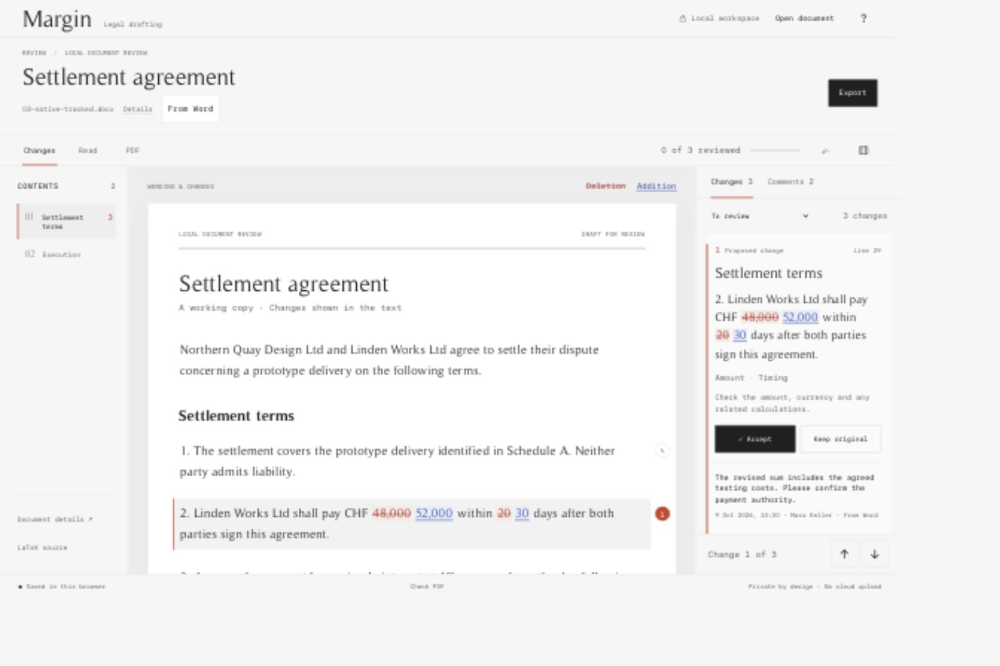

# Margin

A local workspace for reading, revising and comparing legal documents.

Open Word, LaTeX or plain text. Read changes in their paragraph, keep or accept the proposed wording, and carry comments into an editable Word document or a typeset PDF. LaTeX supplies the document source and PDF typesetting behind the reading interface.

Margin is an early, single-user prototype. Its document checks use fictional fixtures. Ease of use comparable to Word is a design objective, not a measured claim, and conversion is deliberately conservative where content cannot be preserved safely.



[Phone review layout](docs/margin-mobile.jpg)

## Start locally

Requirements: Node.js 22 or newer. The source-review interface can run without the optional conversion tools.

```sh
npm ci
npm start
```

Open **http://127.0.0.1:4317**. Keep the terminal open. On macOS, `Start Margin.command` is also available after dependencies are installed.

### Word and PDF conversion on macOS

Conversion requires macOS `sandbox-exec`. There is no Linux or Windows conversion sandbox yet; unsupported platforms keep the source-review interface available and report conversion as unavailable.

Install Python 3.11 or newer, Pandoc 3.9 or newer, and Poppler (`pdftoppm`). Install MacTeX or a TeX Live distribution with XeLaTeX for PDF output. The generated document templates use `fontspec`, TeX Gyre Pagella, `geometry`, `parskip`, `hyperref`, `longtable`, `booktabs`, `array`, `calc` and `multirow`; redlines additionally need the packages requested by `latexdiff`, including `ulem` and `xcolor`. A full MacTeX installation supplies these.

Create the local Python environment:

```sh
python3 -m venv .venv
.venv/bin/python -m pip install -r requirements.txt
npm start
```

Margin discovers the project `.venv`, tools on `PATH`, standard Homebrew locations and MacTeX's `/Library/TeX/texbin`. These optional environment variables select trusted installations:

| Variable | Purpose |
| --- | --- |
| `MARGIN_WORD_PYTHON` | Python interpreter with lxml for Word conversion |
| `MARGIN_PYTHON` | Python interpreter with pypdf for PDF cleanup; also the default Word interpreter |
| `MARGIN_PANDOC` | Pandoc executable |
| `MARGIN_XELATEX` | XeLaTeX executable |
| `MARGIN_TEX_ROOT` | TeX Live installation root, if it is not discoverable from XeLaTeX |
| `MARGIN_PDFTOPPM` | PDF page renderer |
| `MARGIN_DATA_DIR` | Private original-file directory; defaults to `.margin-data` |
| `PORT` | Local HTTP port; defaults to `4317` |

The earlier `FOLIO_*` environment variable names remain accepted. Explicit paths take precedence over discovery. Python virtual-environment and XeLaTeX invocation paths are preserved rather than replaced with their symlink targets. The sandbox grants read access to the selected toolchain's dependency directories; unusual installations may require additional, narrowly scoped configuration.

## Working with a document

- **Open document** accepts one `.docx` up to 4 MB, a standalone UTF-8 `.tex` file up to 300 KB, or plain text up to 150 KB. Plain text is escaped into LaTeX. LaTeX imports retain their original source text, including BOM and line endings.
- **Compare versions** accepts two clean Word or LaTeX documents. Open a Word file with existing tracked changes on its own first: those changes become decisions to review, rather than being silently accepted.
- **Accept** and **Keep original** apply to a balanced passage or clause. Several word edits within a paragraph can share one decision. Completed decisions can be reopened.
- **Edit wording** supports plain paragraphs and simple numbered clauses produced by Word import. It preserves source wrappers, other decisions and comment context. Formatted, footnoted, nested or otherwise unsupported passages remain read-only in this editor.
- **Read** shows the current wording, including pending proposals. **PDF** shows the compiled pages. Exact LaTeX is available from document details.
- Comments on changed and unchanged passages stay visible. Imported comments retain supplied authors and dates. Add a response without replacing the received comment.
- Use **J/K** to navigate, **A/R** to accept or keep original, **N** to comment, and **⌘Z / Ctrl+Z** to undo a local decision, comment or wording edit.

The active review is saved in the browser. Opening another document keeps the previous one under **Recent reviews**. **Save review** creates a portable `.margin.json` file with sources, decisions, comments, conversion information and preserved original Word bytes. Earlier `.folio.json` review files remain readable. Browser storage is not a backup.

### Export

Both **Reviewed document** and **Redline of your review** require every change to be decided. Each offers Word and PDF. The redline compares the same reviewed wording with the original.

Word redlines contain actual native Word revisions, attributed to **Margin** as a newly generated comparison. Incoming revision authors and dates remain in the original and conversion record. A clean Word document applies revision decisions and can still contain comments. Comment export is blocked when an anchor would be missing or ambiguous. Reviewed LaTeX source and a PDF redline of the complete incoming proposal are also available.

## Preservation and limits

Margin saves imported Word bytes separately, verifies their SHA-256 hashes, and offers **Save original** in document details. It does not modify the source file. Conversions and exports use temporary copies.

Supported text, native numbering, footnotes, revision endpoints and comment provenance are preserved. The conversion screen provides notices and a wording comparison. Word output uses a consistent legal layout; original pagination, headers, typography and section layout are not reproduced. A comment may be attached to its containing paragraph instead of its original character range, with a notice. Mixed clause decisions can require a numbering check.

Known unsupported content receives specific notices, including text boxes, images, fields, content controls, headers, formatting revisions and tracked table rows. Field results can become plain text. Unanchored comments remain in the original and conversion record. Word export rejects unsupported LaTeX instead of silently dropping it and verifies the generated paragraph, numbering and footnote endpoints. These checks are bounded; they do not establish general Word round-trip fidelity.

The reading view simplifies LaTeX. Use the exact source and compiled PDF to inspect typography, maths, references and macro expansion. Multi-file LaTeX projects, bibliographies, graphics, private fonts and custom classes are not imported. Amount, timing and obligation tags are prompts for human review, not legal analysis.

Margin does not provide simultaneous editing, authenticated reviewer identities, formal approval, signing, sending or filing. The JSON review record is not a tamper-proof legal audit trail. Read [SECURITY.md](SECURITY.md) before using it with sensitive documents.

## Design and fonts

The interface uses a restrained monochrome palette, a document-first layout and a serif reading surface. [Paper Mono](https://paper.design/mono) is bundled for compact controls and technical detail under SIL Open Font License 1.1. Timeless Regular and Bold may be installed through your operating system’s font manager as an optional serif face; those binaries are not redistributed here. Without them, the interface uses Times New Roman or the platform serif font. See [font setup](public/fonts/README.md).

## Development

```sh
npm run check
npm test
```

`npm test` runs the platform-independent source, authoring, reading and local API checks. With the macOS Word dependencies installed:

```sh
npm run test:word
.venv/bin/python test/test_word_engine.py
```

The Node Word suite exercises the real sandbox, preserved originals, portable restoration, comments, revisions, footnotes, metadata and native export. The Python suite checks conversion semantics and unsafe inputs using fictional documents. Python engine tests are not themselves a secure route for processing untrusted files. PDF output and visual layout also need inspection after relevant changes.

| File | Responsibility |
| --- | --- |
| `lib/review.mjs` | Source comparison, review units, decisions and attention prompts |
| `lib/authoring.mjs` | Conservative prose editing and comment/decision remapping |
| `lib/word.mjs` | Word request bounds, sandbox execution, originals and comment mapping |
| `lib/word_engine.py` | DOCX inspection, conversion and native Word export |
| `lib/compile.mjs` | Isolated PDF compilation and rendering |
| `lib/runtime.mjs` | Portable tool discovery and sandbox runtime paths |
| `public/` | Local browser interface |

## License

Margin's original code is [MIT licensed](LICENSE). The separately invoked, unmodified `latexdiff-so` program is GPL-3.0-or-later, with complete source and license retained under `lib/vendor/`. Paper Mono and npm dependencies retain their own licenses. Read [THIRD_PARTY_NOTICES.md](THIRD_PARTY_NOTICES.md) before redistribution.
